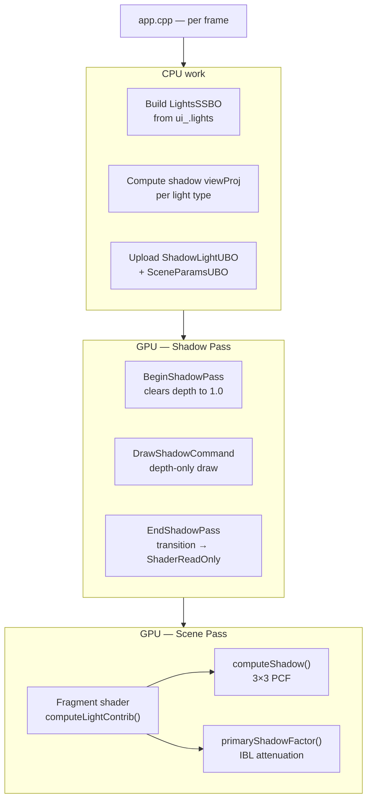
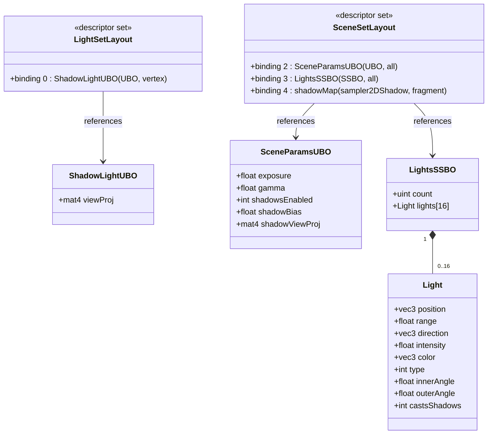
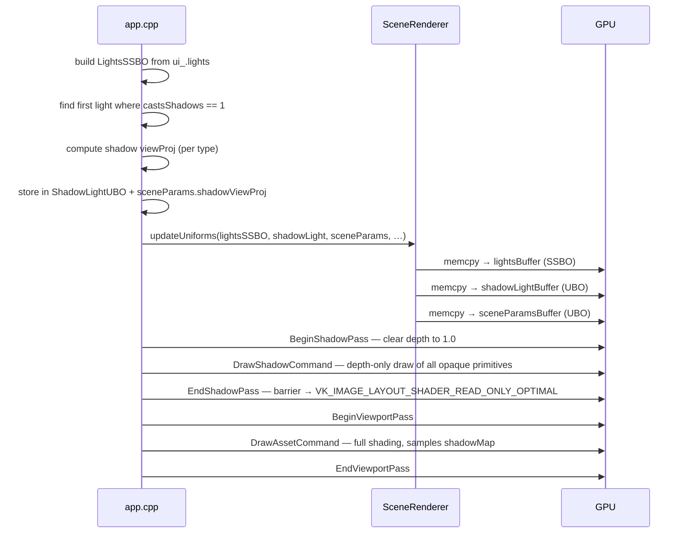
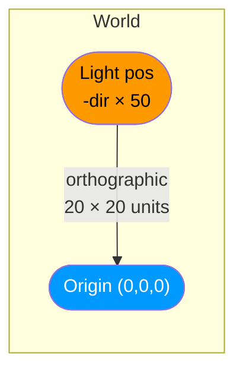
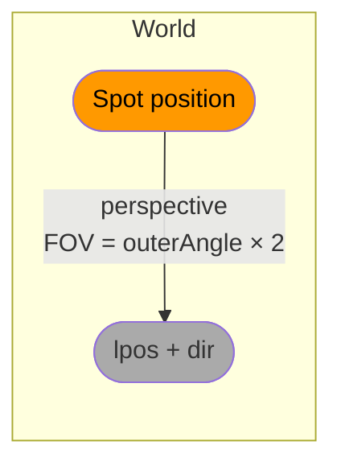
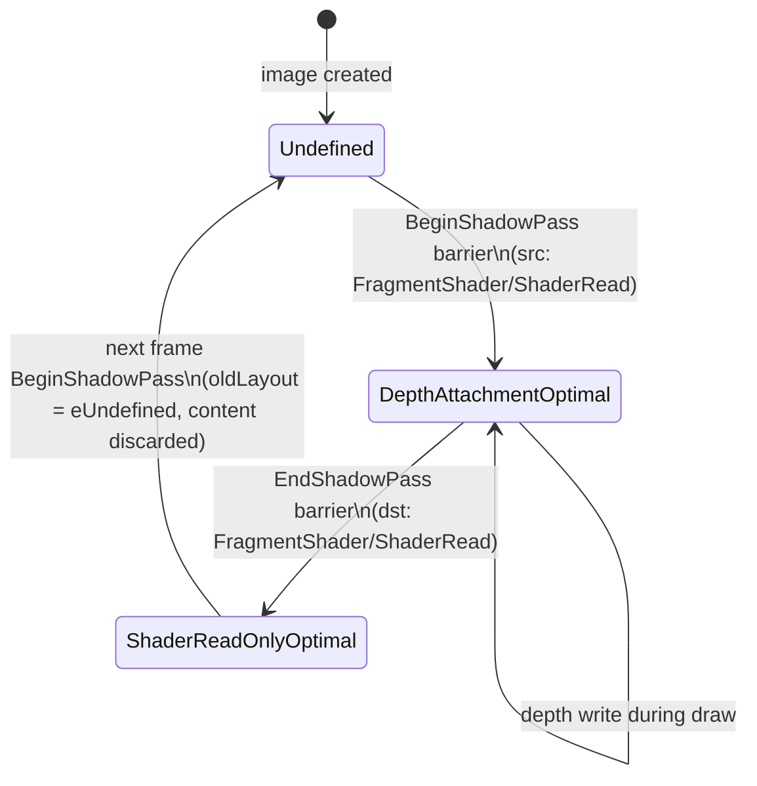
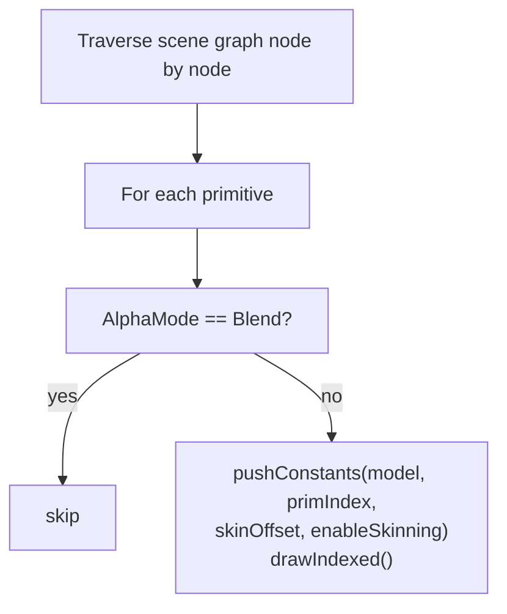
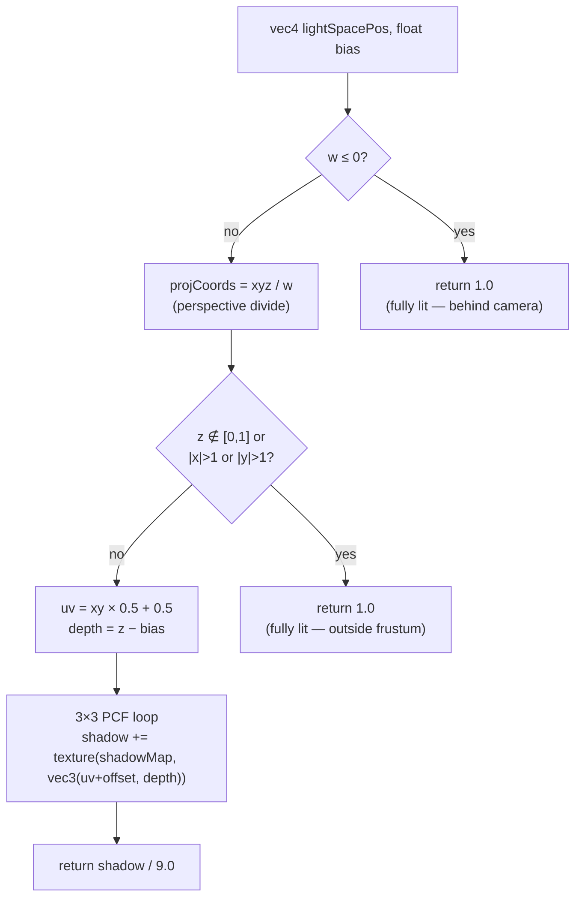
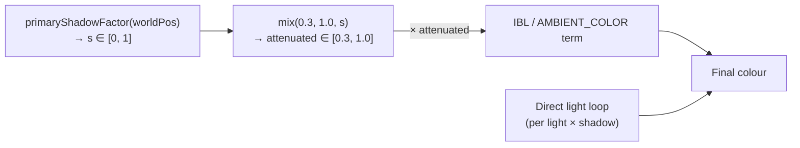
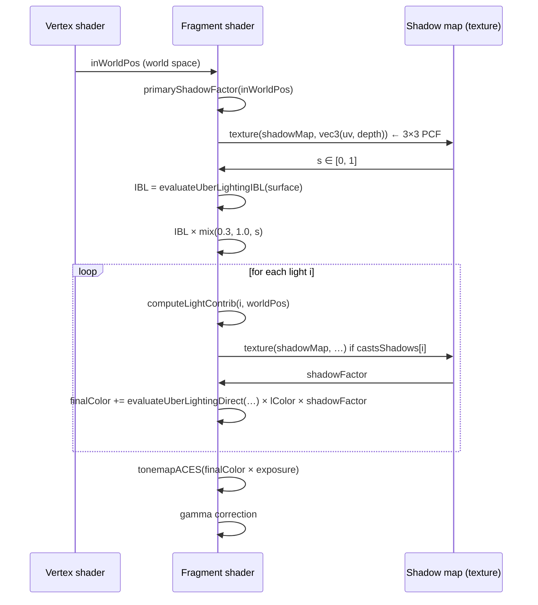

# Shadow System

This document describes the full shadow pipeline as implemented in vkit — from CPU-side matrix
construction through the GPU depth pass to per-fragment shadow lookup and IBL attenuation.

---

## Table of Contents

1. [Overview](#overview)
2. [Data Structures](#data-structures)
3. [Frame-Level Pipeline](#frame-level-pipeline)
4. [Shadow Matrix Construction](#shadow-matrix-construction)
5. [Shadow Render Pass (Depth Write)](#shadow-render-pass-depth-write)
6. [Fragment-Shader Shadow Lookup](#fragment-shader-shadow-lookup)
7. [PCF Filtering](#pcf-filtering)
8. [IBL Ambient Attenuation](#ibl-ambient-attenuation)
9. [Per-Material Integration](#per-material-integration)
10. [Known Limitations](#known-limitations)

---

## Overview

The system uses a **single shadow map** updated every frame from the first shadow-casting light.
It supports three projection strategies — one per light type — and applies the result to both
direct lighting and IBL ambient through a shared `primaryShadowFactor` helper.



**Guard conditions** — the shadow pass only runs when all three are true:

| Condition | Where checked |
|---|---|
| An asset is loaded | `app.cpp` |
| `sceneParams.shadowsEnabled == 1` | `app.cpp` |
| At least one light has `castsShadows == 1` | `app.cpp` (`any_shadow_caster`) |

---

## Data Structures



`ShadowLightUBO` is consumed exclusively by `shadow.vert` to transform vertex positions into
the light's clip space.  `SceneParamsUBO.shadowViewProj` is the same matrix, stored again so
fragment shaders can sample the shadow map without an extra descriptor binding.

---

## Frame-Level Pipeline

Each frame the CPU executes this sequence before recording any command buffers:



---

## Shadow Matrix Construction

Only the first `castsShadows == 1` light produces a shadow map. The projection strategy differs
by light type.

### Directional light

An orthographic frustum is placed 50 units along the *negative* light direction and looks toward
the world origin. This gives a fixed 20×20 unit coverage centred on the origin.

```
lpos   = -normalize(light.direction) * 50
lview  = lookAt(lpos, vec3(0), worldUp)
lproj  = orthoRH_ZO(-10, +10, -10, +10, 0.1, 100)
```



### Spot light

A perspective frustum is aligned with the spot's facing direction. The FOV equals twice the
outer cone angle so the shadow exactly covers what the spot illuminates.

```
lpos   = light.position
lview  = lookAt(lpos, lpos + normalize(light.direction), worldUp)
lproj  = perspectiveRH_ZO(outerAngle × 2, 1.0, 0.1, range × 2)
```



### Point light *(approximation)*

A point light illuminates in all directions; a single 2D shadow map cannot capture this
accurately. The current implementation casts an orthographic shadow aimed from the light toward
the world origin — an approximation sufficient for scenes centred near the origin.

```
lpos   = light.position
lview  = lookAt(lpos, vec3(0), worldUp)
lproj  = orthoRH_ZO(-10, +10, -10, +10, 0.1, range × 2)
```

> **Limitation** — a cube-map shadow would be required for a physically correct point-light
> shadow. See [Known Limitations](#known-limitations).

---

## Shadow Render Pass (Depth Write)

### Image layout transitions



`BeginShadowPass` always specifies `oldLayout = eUndefined` — this tells the driver it may
discard previous content, which is correct because the attachment is cleared to depth 1.0
(`loadOp = eClear`) on every pass.

### What gets drawn

`DrawShadowCommand` traverses the scene graph and submits every **opaque** primitive.
Transparent (`AlphaMode::kBlend`) primitives are skipped — they do not write to the depth
buffer and therefore cannot cast hard shadows.



The vertex shader (`shadow.vert`) used here only outputs `gl_Position`; there is no fragment
shader output.  The pipeline has `rasterizationSamples = 1` and depth bias disabled.

---

## Fragment-Shader Shadow Lookup

### `computeLightContrib` — `shaders/common/lights.glsl`

When a light has `castsShadows == 1` and global `shadowsEnabled == 1`, the shadow factor is
computed once per light contribution:

```glsl
vec4 lsPos = sceneParams.shadowViewProj * vec4(worldPos, 1.0);
shadowFactor = computeShadow(shadowMap, lsPos, sceneParams.shadowBias);
```

`sceneParams.shadowViewProj` is the same matrix used in the shadow pass — this guarantees that
the depth comparison is made in the same coordinate space as the depth values stored in the map.

### `computeShadow` — `shaders/common/shadow.glsl`



**`w ≤ 0` guard** — for perspective shadow cameras (spot lights), vertices behind the camera
produce negative `w`, which would flip the sign of `projCoords` and cause false shadowing.
The early return treats them as fully lit.

**Frustum clip** — anything outside `[-1, 1]` in X/Y or outside `[0, 1]` in Z (Vulkan depth
convention, `_ZO` matrix family) is outside the light frustum and returned as fully lit.

**Bias** — `sceneParams.shadowBias` (default 0.005) is subtracted from the reference depth
before comparison to avoid shadow acne caused by depth-precision aliasing.

---

## PCF Filtering

Percentage Closer Filtering averages the binary shadow test across a **3×3 texel neighbourhood**,
producing soft shadow edges without blurring the stored depth values.

```
offset grid (in texels):
(-1,-1)  (0,-1)  (+1,-1)
(-1, 0)  (0, 0)  (+1, 0)
(-1,+1)  (0,+1)  (+1,+1)
```

Each sample uses hardware-accelerated bilinear depth comparison (`sampler2DShadow`).
The 9 results (each 0.0 or 1.0) are summed and divided by 9.

```
shadowFactor = 0.0   → fully in shadow
shadowFactor = 1.0   → fully lit
shadowFactor ∈ (0,1) → penumbra (partially lit)
```

---

## IBL Ambient Attenuation

Standard direct-light shadowing stops at `lightColor *= shadowFactor`. Without further work,
objects in deep shadow still receive the full IBL ambient (irradiance + prefiltered specular),
which looks unrealistic in outdoor scenes.

### `primaryShadowFactor` — `shaders/evaluation.glsl`

```glsl
float primaryShadowFactor(vec3 worldPos) {
    if (sceneParams.shadowsEnabled == 0) return 1.0;
    for (uint i = 0; i < lightsBlock.count; i++) {
        if (lightsBlock.lights[i].castsShadows == 0) continue;
        vec3 L; vec3 lColor; float shadow;
        computeLightContrib(i, worldPos, L, lColor, shadow);
        return shadow;   // only the first shadow caster
    }
    return 1.0;
}
```

This reuses the same `computeShadow` path (same map, same matrix) so there is zero extra cost
beyond the shadow lookup that would have happened anyway in the direct lighting loop.

### Application to material models



| Material | IBL / ambient term | Attenuation applied |
|---|---|---|
| Principled BSDF | `evaluateUberLightingIBL(…)` | `× mix(0.3, 1.0, s)` |
| Diffuse | `AMBIENT_COLOR` constant | `× mix(0.3, 1.0, s)` |
| Diffuse-Specular | `AMBIENT_COLOR` constant | `× mix(0.3, 1.0, s)` |
| Fallback | `AMBIENT_COLOR` constant | `× mix(0.3, 1.0, s)` |

The floor value of **0.3** (30 % ambient retained in full shadow) prevents completely black
objects in shadowed areas — pure black rarely occurs in real scenes due to bounced light.

---

## Per-Material Integration

The complete per-fragment shading sequence for **Principled BSDF**:



---

## Known Limitations

| Issue | Impact | Possible fix |
|---|---|---|
| Single shadow map | Only one light can cast shadows (first `castsShadows == 1` light) | Shadow atlas or per-light maps |
| Point light uses orthographic shadow | Shadow coverage is directional (toward origin), not omnidirectional | Cube-map shadow pass (6 faces) |
| Directional/point shadow frustum targets world origin | Misses scenes not centred at origin | Compute frustum from camera visibility volume (CSM) |
| Fixed 20×20 unit ortho area | Low resolution for large scenes, wasted pixels for small ones | Cascade shadow maps (CSM) |
| No slope-scale depth bias | Step-like shadow acne on surfaces facing away from light | Add `gl_FragDepth` offset or `VK_EXT_depth_bias_control` |
| IBL attenuation is approximate | Uses directional shadow map, not true ambient occlusion | SSAO post-process pass |
| Transparent geometry casts no shadow | Semi-transparent objects appear to be fully lit | Coloured shadow maps or stochastic transparency |
